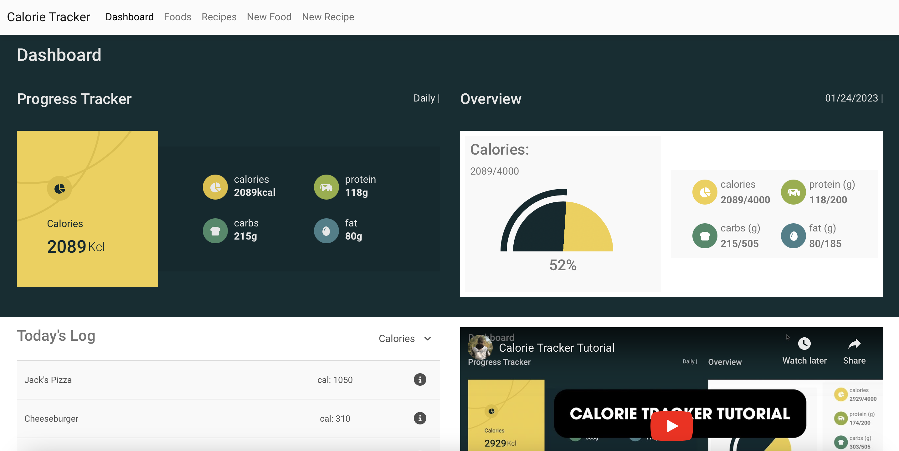

<h1 align="center">Welcome to Calorie Tracker 👋</h1>
<p>
  
   
   
   
</p>

> This application is a calorie tracker to monitor calories, protein, carbs, and fat on a daily basis.

<p>

</p>

### 🏠 [Homepage](https://calorietracker.johngaynor.dev)

## Description

Calorie tracker allows users to create foods/recipes, calculate nutrition information by inputting weight values, and track important statistics such as calories and protein throughout the day.

## Tech Stack

- HTML/CSS
- Bootstrap
- React.js
- Bootstrap
- Firebase
<!--

## Run tests

````sh

``` -->

## Version History

1.0.0 - Initial launch, Realtime Database open to the public to contribute foods/recipes and store nutritional information in the daily log

2.0.0 - User auth, major architecture changes, user-specific content, demo mode if not logged in

## Future Releases
- Default foods/recipes
- Weekly analysis
- User customizability (i.e. setting custom macro goals)

## V3 Releases
- Change API calls to make only 1 at the foods/recipes page, instead of a call at each level going down the chain

## V4 Anticipated Releases
- Global tooltip component
- Fix bug where deleting last ingredient from a recipe deletes the recipe itself
- Add catch to make sure macros cannot be negative
- New routing for custom categories
- Possibility to add custom category for recipes

## Author

👤 **John Gaynor**

- Portfolio: https://johngaynor.dev
- Github: [@johngaynor](https://github.com/johngaynor)
- LinkedIn: [@john-gaynor-71092a262](https://linkedin.com/in/john-gaynor-71092a262)

---

_This README was generated with ❤️ by [readme-md-generator](https://github.com/kefranabg/readme-md-generator)_

````
